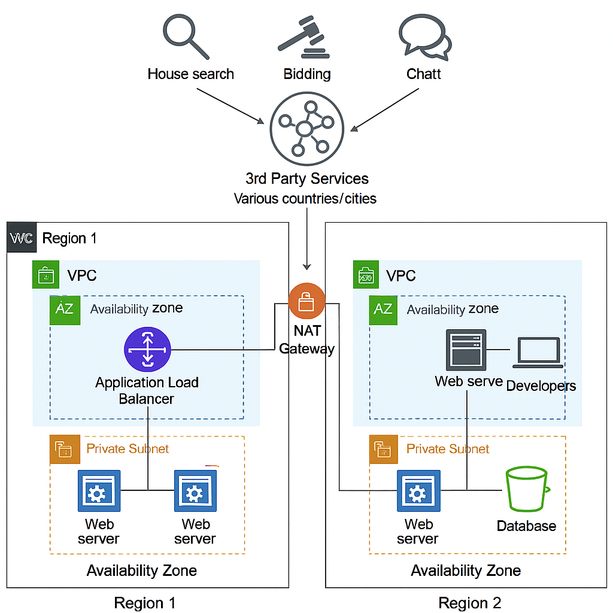

# Real Estate Finder – Network Architecture
This repository contains the network architecture for a distributed, multi-region, real estate search and transaction platform.

## 📊 Architecture Diagram

---
Project Details:
The project is a Real Estate Finder Platform designed to serve users across multiple countries and cities. The platform allows users to search for properties, place bids, and communicate with buyers or sellers via chat. To deliver a high-performance and fault-tolerant experience, the system integrates with multiple third-party services and supports both development and production workloads. The system is designed to be highly available, scalable, and regionally redundant, with deployments across two regions and two availability zones per region.

Architecture Decisions:
The architecture uses a multi-region and multi-AZ approach to achieve resilience and low latency. Each region contains a Virtual Private Cloud (VPC), which is divided into public and private subnets across two Availability Zones. Load balancers are placed in the public subnets to distribute traffic to web servers in the private subnets. Web servers process incoming requests and interact with backend services such as databases and third-party APIs.

A NAT Gateway allows the web servers in private subnets to initiate outbound connections to the internet (e.g., fetching third-party data) while maintaining security. Developers access isolated web servers and development environments in Region 2.

Reasoning:
The use of Application Load Balancers (ALB) in front of the web servers ensures efficient routing of user requests, automatic failover, and scalability under high traffic. Splitting services across two regions and AZs provides redundancy in case of failure in any region or data center. NAT gateways allow private servers to fetch data from third-party APIs without exposing them to public networks, ensuring security compliance.

The presence of developer-specific environments in Region 2 avoids impacting the production load, allowing agile development and testing in a controlled space. This architecture balances performance, security, cost-efficiency, and disaster recovery.

Networking Components Used and Their Use Case
| Component                     | Use Case                                                                 |
| ----------------------------- | ------------------------------------------------------------------------ |
| **VPC**                       | Logical isolation of network resources per region                        |
| **Availability Zones**        | High availability within a region                                        |
| **Public Subnet**             | Hosting internet-facing components like load balancers                   |
| **Private Subnet**            | Hosting internal web servers and databases securely                      |
| **Application Load Balancer** | Distributes user traffic across web servers with health checks           |
| **Web Servers**               | Serve web application content and business logic                         |
| **NAT Gateway**               | Enables outbound internet access from private subnet servers             |
| **Database (e.g., RDS, S3)**  | Stores persistent data and backups                                       |
| **Third-Party Services**      | External APIs for property listings, maps, chat, and payment integration |
| **Developer Web Server**      | Isolated environment for development and testing                         |

General Assumptions:
Target Users are global, accessing the platform primarily via web and mobile.
The platform will have a moderate to high number of concurrent users (100 to 100,000+).
Users will require real-time interactions such as chat, bidding, and property search.

Infrastructure & Deployment Assumptions:

The platform is hosted on a cloud provider (e.g., AWS, GCP, Azure) that supports:
VPCs
Availability Zones
Auto Scaling
Load Balancers
Managed databases
Each region contains two availability zones for high availability.
VPC peering or inter-region VPN/Transit Gateway is assumed for secure inter-region communication.
Application Load Balancer (ALB) is used in the public subnet to distribute HTTP/HTTPS traffic.
Auto-scaling groups are used behind load balancers for web servers to handle variable load.

Network & Security Assumptions:
Public subnets are only used for Load Balancers and NAT Gateways.
Private subnets host application servers, databases, and internal services.
NAT Gateway is used to enable secure outbound traffic for internal components.
Internet Gateway (IGW) is assumed for inbound/outbound internet access via public subnets.
Security Groups and NACLs are configured to restrict unnecessary traffic.

Development and Operations Assumptions:
Developers require isolated access to development environments hosted in Region 2.
CI/CD pipelines are assumed to deploy to dev/staging/prod environments via secure internal access.
Logging, monitoring (e.g., CloudWatch, ELK), and backups are assumed but not explicitly shown in the diagram.

Data & Integration Assumptions:
The platform fetches real estate listings, pricing, and user data from third-party APIs, assumed to be REST-based.
Caching (e.g., Redis/CloudFront) is assumed but not shown, for performance optimization.
Relational database (e.g., RDS, PostgreSQL) is used for transactional data.
S3 or equivalent is used for media (images, videos) storage.

Assumptions for Costing:
Compute: Auto-scaling EC2 (t3.medium or c5.large) for app servers
Load Balancer: Application Load Balancer (ALB)
Database: Amazon RDS (PostgreSQL, Multi-AZ), with scaling for connections
Storage: Amazon S3 for property images & user uploads
Data Transfer: Based on public user access + 3rd-party API fetches
NAT Gateway: Fixed + per GB data cost
Chat/Bidding: Uses WebSocket-style implementation or external real-time APIs
Dev Environment: Separate compute instances assumed constant

Monthly Cost Estimate Table:

| Users (Concurrent / MAU) | EC2 (App Servers) | ALB   | RDS (DB) | S3 (Storage) | Data Transfer | NAT Gateway | Total (Approx) |
| ------------------------ | ----------------- | ----- | -------- | ------------ | ------------- | ----------- | -------------- |
| **100 / 100K**           | \$100             | \$25  | \$100    | \$20         | \$50          | \$30        | **\$325**      |
| **10K / 1M**             | \$500             | \$100 | \$300    | \$100        | \$300         | \$75        | **\$1,375**    |
| **100K / 10M**           | \$3,000           | \$300 | \$1,500  | \$800        | \$2,000       | \$150       | **\$7,750**    |
| **100K+ / 100M**         | \$12,000          | \$800 | \$4,000  | \$5,000      | \$12,000      | \$300       | **\$34,100**   |

Notes:
EC2 Cost includes Auto Scaling Groups across 2 regions and 2 AZs (price varies based on instance types).
ALB is calculated by number of requests + active hours.
RDS includes Multi-AZ PostgreSQL with read replicas as users scale.
S3 storage grows with the number of listings, images, and videos.
Data Transfer assumes 1–100 TB outbound based on usage.
NAT Gateway cost includes per GB charges + hourly fixed charges.
Total includes approximate figures rounded for simplification and operational efficiency buffers.

